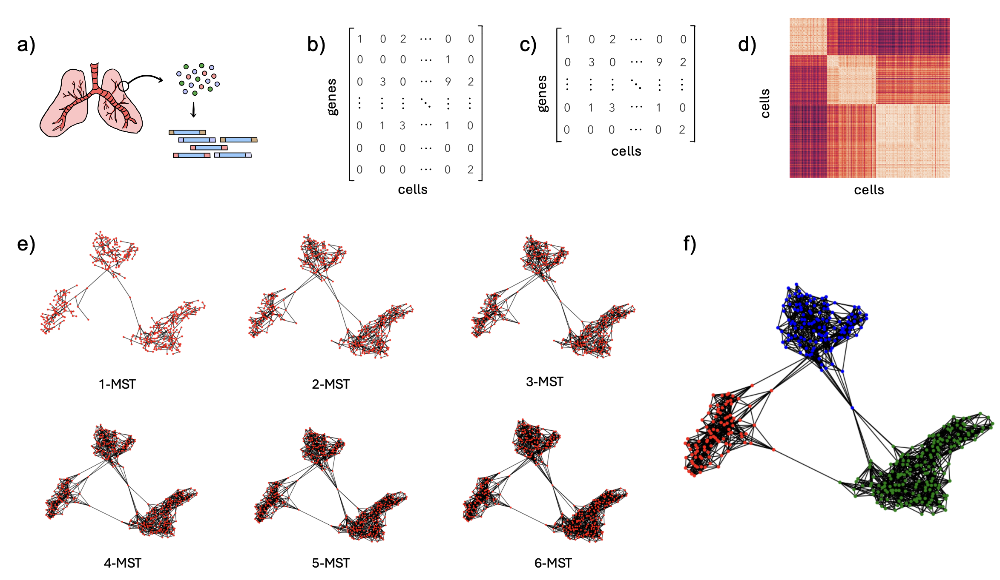
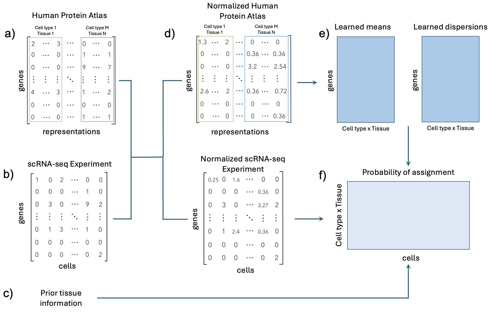

# Metodologías de identificación de tipos celulares a partir de datos de secuenciación de RNA de célula sencilla. 
En este repositorio se encuentra la implementación del demo desarrollado durante la tesis de grado de Melissa Robles de la Maestría en Inginiería de Sistemas y Computación de la Universidad de Los Andes (2024). El demo implementado en este repositorio permite la ejecución de tres algoritmos de agrupamiento de datos de scRNA-seq: k-MST basado en grafos, AE-GMM basado en redes neuronales y Negative Binomial Naive Bayes, basado en la basde de Human Protein Atlas [1].

## Algoritmos
### k-MST

Algoritmo no supervisado basado en grafos. a) Realizar la secuenciación de RNA de una sola célula. b) Generar la matriz de conteo. c) Filtrado de genes: Retener solo los 5000 genes con la desviación más alta de la varianza ajustada. d) Calcular la correlación de Pearson por pares entre células. e) Calcular el grafo k-MST. f) Aplicar el algoritmo de Louvain para la detección de comunidades.


### AE-GMM

Siguiendo la metodología de scDCC [2], el entrenamiento de la red se realiza en dos etapas. Primero, el autoencoder se preentrena utilizando la función de pérdida $\mathcal{L}_{ZINB}$. Luego, se lleva a cabo una etapa de ajuste fino en la cual se optimiza la representación latente, guiada por la función de pérdida de GMM. En esta etapa, el modelo aprende los parámetros de cada función gaussiana para realizar un clustering probabilístico. Específicamente, aprende tres parámetros: $\pi_c \in \mathbb{R}$, $\mu_c \in \mathbb{R}^{32}$ y $\Sigma_c \in \mathbb{R}^{32×32}$ para cada cluster $c$. El valor de $\mu_c$ representa la media del cluster $c$. Estos valores de media se inicializan como los centroides encontrados por el algoritmo de k-means. Para cada cluster $c$, $\Sigma_c$ representa la matriz de covarianza de $c$ y $\pi_c$ representa su peso, el cual se puede interpretar como la probabilidad a priori de que una célula sea asignada a dicho cluster.

### Negative binomial Naive Bayes

Algoritmo supervisado basado en la distribución binomial negativa. Se reciben tres entradas, la base de Human Protein Atlas (a), la matriz de conteos del experimento a analizar (b) y el tejido del experimento (c). Se realiza una normalización de los datos para garantizar que se mantengan las mismas magnitudes (d) y se procede a entrenar el modelo (e), en donde se aprenden las medias y dispersiones de cada gen en los tipos celulares considerados. Finalmente, con la base normalizada se obtienen las probabilidades de cada célula de pertenecer a los tipos celulares del HPA (f).


## Uso
Para ejecutar de forma local el demo, se debe acceder a la carpeta `Back/Python` y ejecutar el comando 
```
uvicorn main:app  --port 8080
```
Además, se debe abrir el archivo `front/loadData.html` para comenzar a interactuar con el Demo.

## Referencias 
[1] Karlsson, M., Zhang, C., M´ear, L., Zhong, W., Digre, A., Katona, B., Sjostedt, E., Butler, L., Odeberg, J., Dusart, P., Edfors, F., Oksvold, P., Feilitzen, K., Zwahlen, M., Arif, M., Altay, O., Li, X., Ozcan, M., Mardinoglu, A., Fagerberg, L., Mulder, J., Luo, Y., Ponten, F., Uhlen, M., Lindskog, C.: A single–cell type transcriptomics map of human tissues. Science Advances 7(31), 2169 (2021) https://doi.org/10.1126/sciadv.abh2169 

[2] Tian, T., Zhang, J., Lin, X., Wei, Z., Hakonarson, H.: Model-based deep embedding for constrained clustering analysis of single cell rna-seq data (2021) https: //doi.org/10.1038/s41467-021-22008-3 